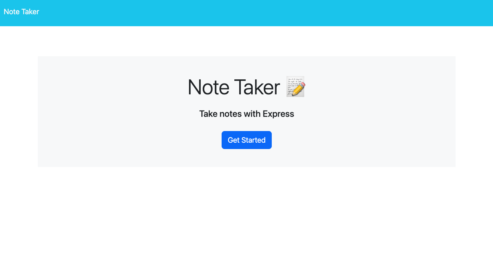
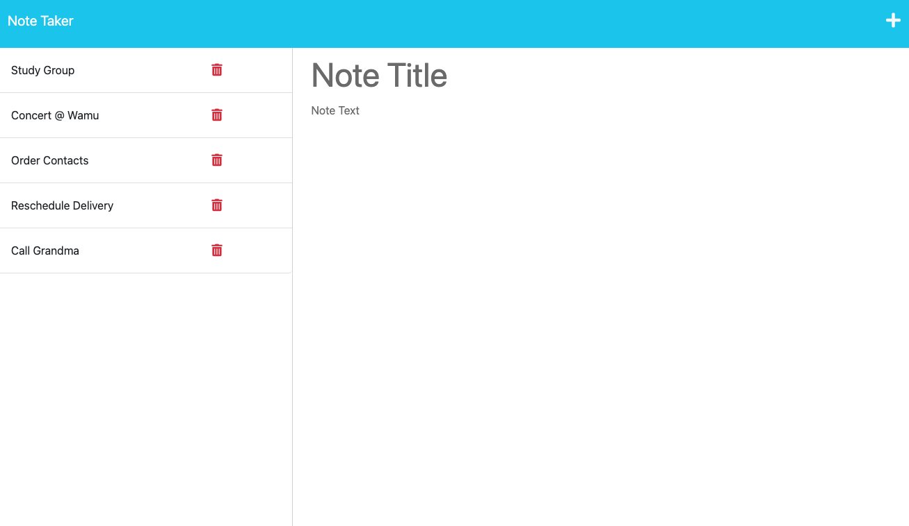

# Note Taker 📝

## Table of Contents

- [Description](#📚-description)
    - [User Story](#👤-user-story)
    - [Acceptance Criteria](#☑️-acceptance-criteria)
- [Technologies Used](#🛠️-technologies-used)
- [Usage](#💻-usage)
    - [Screenshots](#📸-screenshot)
- [License](#📃-license)
- [Links](#🔗-links)

## 📚 Description 

For this challenge we were tasked with adding the back end code for an application that can be used to write and save notes. We were given starter code that included completed front end code, it was then our job to use an Express.js back end to save and retrieve note data from a JSON file. After building the back end we needed to connect the two and then deploy the application to Heroku.


### 👤 User Story

```md
AS A small business owner
I WANT to be able to write and save notes
SO THAT I can organize my thoughts and keep track of tasks I need to complete
```

### ☑️ Acceptance Criteria

```md
GIVEN a note-taking application
WHEN I open the Note Taker
THEN I am presented with a landing page with a link to a notes page
WHEN I click on the link to the notes page
THEN I am presented with a page with existing notes listed in the left-hand column, plus empty fields to enter a new note title and the note’s text in the right-hand column
WHEN I enter a new note title and the note’s text
THEN a Save icon appears in the navigation at the top of the page
WHEN I click on the Save icon
THEN the new note I have entered is saved and appears in the left-hand column with the other existing notes
WHEN I click on an existing note in the list in the left-hand column
THEN that note appears in the right-hand column
WHEN I click on the Write icon in the navigation at the top of the page
THEN I am presented with empty fields to enter a new note title and the note’s text in the right-hand column
```

## 🛠️ Technologies Used

<ul>
<li>HTML
<li>CSS
<li>JavaScript
<li>Node 
<li>Express
<li>Heroku
</ul>


## 💻 Usage

**Step 1:** open the note taking app  
**Step 2:** click get started  
**Step 3:** create a note with a note title and note text in the right-hand column  
**Step 4:** click on the save icon to save the note  
**Step 5:** saved notes will appear in the left-hand column  
**Step 6:** to expand any saved note click on it and it will display in the right-hand column  
**Step 7:** to add a new note click the plus icon and repeat steps 3 - 5  

***To Delete***  
**Step 8:** to delete a saved note click the trash icon to the right of it  

### 📸 Screenshots





## 📃 License

Please refer to the LICENSE in the repo.


## 🔗 Links

Deployed Application: https://note-taker1127.herokuapp.com/